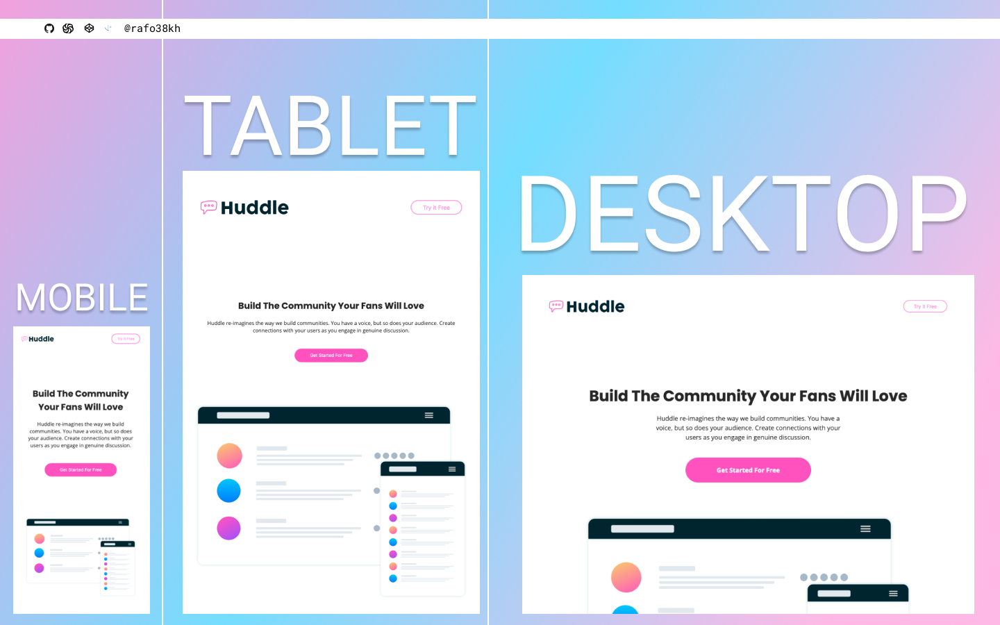

# Frontend Mentor - Huddle Landing Page with Curved Sections solution

This is a solution to the [Huddle Landing Page with Curved Sections Challenge on Frontend Mentor](https://www.frontendmentor.io/challenges/huddle-landing-page-with-curved-sections-5ca5ecd01e82137ec91a50f2)

## Table of contents

- [Overview](#overview)
  - [The challenge](#the-challenge)
  - [Screenshot](#screenshot)
  - [Links](#links)
- [My process](#my-process)
  - [Built with](#built-with)
- [Author](#author)

## Overview

### The challenge

- View the optimal layout for the site depending on their device's screen size
- See hover states for all interactive elements on the page

### Screenshot

### Links

- Solution URL: 
- Live Site URL: [https://rafo38kh.github.io/huddle-landing-page-with-curved-sections/](https://rafo38kh.github.io/huddle-landing-page-with-curved-sections/)

## My process

### Built with

- Semantic HTML5 markup
- SCSS custom properties
- CSS Flexbox
- CSS Grid
- Vanilla JS
- Mobile-first workflow

## Author

- Frontend Mentor - [@rafo38kh](https://www.frontendmentor.io/profile/rafo38kh)
- GitHub - [@rafo38kh](https://github.com/rafo38kh)
- Codewars - [@rafo38kh](https://www.codewars.com/users/rafo38kh)
